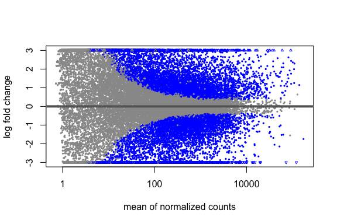
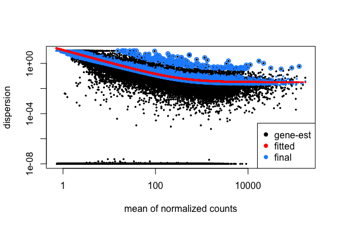
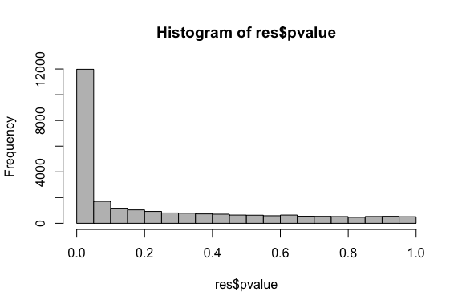
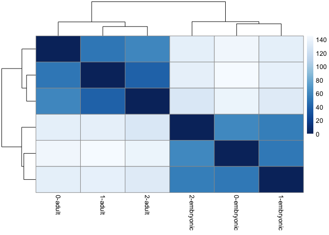
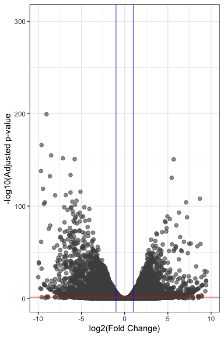

Differential expression analysis (DESeq2) - Embryonic vs. Adult
================
Chelsea Herdman
February 25th, 2021

We performed differential expression analysis using DESeq2 on the
imported bias corrected transcript abundances produced by kallisto and
tximport following the DESeq2 vignette found
[here](http://bioconductor.org/packages/release/bioc/vignettes/DESeq2/inst/doc/DESeq2.html).

### Set up the counts matrix for DESeq

Load required libraries.

``` r
library(data.table)
library(DESeq2)
library(here)
library(RColorBrewer)
library(pheatmap)
library(ggplot2)
library(biomaRt)
```

Load sample info table and make column data dataframe.

``` r
sample_info = fread(here("heart_sampleinfo_tab.txt"))
cData = data.frame(stage=factor(sample_info$stage,
                                 levels=c("embryonic", "adult")),
                   replicate_id=factor(sample_info$replicate_id,
                                       levels=c(0, 1, 2)))
rownames(cData) = sample_info$sample_id
```

Load counts table.

``` r
counts_tab = fread(here("Tximport", "20210225_Wangetal_counts_fromtximport_biascorrected.txt"))
counts_tab = counts_tab[, !c("adult_muscle_0", "adult_muscle_1", "adult_muscle_2")]

counts = as.matrix(counts_tab[, !"ensembl_gene_id"])
rownames(counts) = counts_tab$ensembl_gene_id
storage.mode(counts) = "integer" # DESeq requires us to change numeric values to integer.
```

------------------------------------------------------------------------

### Diagnostics

***Read sum distributions***

``` r
summary(rowSums(counts))
```

    ##    Min. 1st Qu.  Median    Mean 3rd Qu.    Max. 
    ##       0      16     320    7568    2489 7449301

``` r
dim(counts)
```

    ## [1] 32250     6

``` r
sum(rowSums(counts) == 0)
```

    ## [1] 3911

``` r
sum(rowSums(counts) < 5)
```

    ## [1] 5850

``` r
hist(log10(rowSums(counts) + 1), breaks=100, col="grey80")
abline(v=log10(1e6), col="red")
abline(v=log10(10), col="red")
```

<!-- -->

``` r
# Remove genes with fewer than 10 and more than 1e6 reads total (over 9 samples)
# (removes 7462 genes)
counts = counts[rowSums(counts) > 5, ]
counts = counts[rowSums(counts) < 1e6, ]

summary(rowSums(counts))
```

    ##    Min. 1st Qu.  Median    Mean 3rd Qu.    Max. 
    ##       6      98     789    6192    3500  994548

``` r
dim(counts)
```

    ## [1] 26071     6

------------------------------------------------------------------------

### Run Differential Expression Analysis

***Create the DESeqDataSet***

Perform the likelihood ratio test and create a datatable of the
differential expression results.

``` r
dds = DESeqDataSetFromMatrix(countData=counts,
                             colData=cData,
                             design=~ replicate_id + 
                                      stage)

dds = estimateSizeFactors(dds)
dds = estimateDispersions(dds)
```

    ## gene-wise dispersion estimates

    ## mean-dispersion relationship

    ## final dispersion estimates

``` r
dds = nbinomLRT(dds, reduced=~ replicate_id)
res = results(dds, cooksCutoff=FALSE)

plotMA(res, ylim = c(-3, 3))
```

<!-- -->

``` r
plotDispEsts(dds)
```

<!-- -->

``` r
res = as.data.frame(res)
res = data.frame(ensembl_gene_id=rownames(res), res)
res = data.table(res)
setorder(res, pvalue, na.last=TRUE)
length(unique(res$ensembl_gene_id))
```

    ## [1] 26071

``` r
sum(res$padj < 0.05, na.rm=TRUE )
```

    ## [1] 10345

``` r
sum(is.na(res$pvalue))
```

    ## [1] 0

``` r
hist(res$pvalue, breaks=20, col="grey" )
```

<!-- -->

``` r
res05 = results(dds, alpha=0.05)
summary(res05)
```

    ## 
    ## out of 26071 with nonzero total read count
    ## adjusted p-value < 0.05
    ## LFC > 0 (up)       : 5241, 20%
    ## LFC < 0 (down)     : 5189, 20%
    ## outliers [1]       : 0, 0%
    ## low counts [2]     : 2022, 7.8%
    ## (mean count < 3)
    ## [1] see 'cooksCutoff' argument of ?results
    ## [2] see 'independentFiltering' argument of ?results

***Compute Normalized Counts***

Convert matrix of normalized counts into data.table, with a gene\_id
column in order to incorporate into differential expression results
table.

``` r
norm_counts = counts(dds, normalized=TRUE)
norm_tab = data.table(norm_counts)
norm_tab$ensembl_gene_id = rownames(norm_counts)
```

Convert from wide-form to long-form and compute mean normalized counts.

``` r
norm = melt(norm_tab, id.vars="ensembl_gene_id",
            value.name="norm_counts", variable.name="sample_id", 
            variable.factor=FALSE)

norm = merge(x=norm, y=sample_info[, list(sample_id, stage, 
                                          replicate_id)], 
             by="sample_id")

norm[, zcount:=(norm_counts - mean(norm_counts)) / 
     sd(norm_counts), by=ensembl_gene_id]

summary_norm = norm[, list(mean_normcounts=mean(norm_counts)),
                    by=list(ensembl_gene_id, stage)]
```

Convert summary table of mean normalized counts to wide-form and merge
into differential expression results.

``` r
sum_norm = dcast(summary_norm, ensembl_gene_id ~ stage, 
                 value.var="mean_normcounts")

setcolorder(sum_norm, c("ensembl_gene_id", "embryonic", "adult"))

res_sum = merge(res, sum_norm, by="ensembl_gene_id")

setorder(res_sum, pvalue, na.last=TRUE)
```

***rlog transformation***

Perform rlog transformation, taking into account different variability
of samples. Extract the computed rlog values into a matrix, then convert
to long form.

``` r
rld <- rlog(dds, blind=FALSE)
rmat = assay(rld)
rtab = data.table(rmat)
rtab$ensembl_gene_id = rownames(rmat)

rlog_long = melt(rtab, id.vars="ensembl_gene_id", 
                 variable.name="sample_id", value.name="rlog_value")

rlog_long = merge(rlog_long, sample_info[, list(sample_id, 
                                     replicate_id, stage)],
                  by="sample_id")
```

Perform principal component analysis on the rlog values.

``` r
plotPCA(rld, intgroup=c("stage"), ntop=10000)
```

<!-- -->

``` r
vsd <- vst(dds, blind=FALSE, nsub=5000)
sampleDists <- dist(t(assay(vsd)))
sampleDistMatrix <- as.matrix(sampleDists)
rownames(sampleDistMatrix) <- paste(vsd$condition, vsd$type, sep="-")
colnames(sampleDistMatrix) <- paste(vsd$replicate_id, vsd$stage, 
                                    sep="-")
colors <- colorRampPalette( rev(brewer.pal(9, "Blues")) )(255)
pheatmap(sampleDistMatrix,
         clustering_distance_rows=sampleDists,
         clustering_distance_cols=sampleDists,
         col=colors)
```

<!-- -->

Create long-form data.table contain vsd values, for input to DPGP
clustering.

``` r
vsd_mat = assay(vsd)
vtab = as.data.table(vsd_mat, keep.rownames="ensembl_gene_id")
vtab_long = melt(vtab, id.vars="ensembl_gene_id",
                 variable.name="sample_id", value.name="vsd_value")

vtab_long = merge(vtab_long,
                  sample_info,
                  by="sample_id")
```

------------------------------------------------------------------------

### Create complete annotated results table

Fetch annotations from biomaRt using permanent link for GRCz11 - release
99. Merge in gene annotations to DESeq results table

``` r
mart = useMart(biomart="ENSEMBL_MART_ENSEMBL",
               dataset="drerio_gene_ensembl",
               host="may2017.archive.ensembl.org")

annot = getBM(mart=mart,
              attributes=c("ensembl_gene_id",
                           "external_gene_name",
                           "chromosome_name",
                           "gene_biotype"))

annot = as.data.table(annot)

res_sum = merge(res_sum, annot, by="ensembl_gene_id")

setorder(res_sum, padj, na.last = TRUE)

rlog_long = merge(rlog_long, norm, by=c("ensembl_gene_id", "sample_id",
                                        "stage", "replicate_id"))

rlog_long = merge(rlog_long, vtab_long, by=c("ensembl_gene_id", 
                                             "sample_id", "stage", 
                                             "replicate_id"))

rlog_long[, rlog_centered:=rlog_value - mean(rlog_value), 
          by=list(ensembl_gene_id)]

rlog_long = merge(rlog_long, annot, by="ensembl_gene_id")
#fwrite(rlog_long, here("DESeq2",
#             "20210226_embryonicvsadult_vsd_rlog_normcount_long_results.txt"))

#fwrite(res_sum, here("DESeq2", 
 #                   "20210226_embryonicvsadult_deseq2_results.txt"))
```

------------------------------------------------------------------------

### Visualize DE results

``` r
v1 = ggplot(res_sum, aes(x=log2FoldChange, y=-log10(padj))) +
  theme_bw() +
  geom_point(size=2, colour="grey30", alpha=0.6) +
  geom_vline(xintercept=c(-1, 1), colour="blue", alpha=0.6) +
  geom_hline(yintercept=-log10(0.05), colour="red", alpha=0.6) +
  xlim(-10, 10) +
  ylab("-log10(Adjusted p-value") +
  xlab("log2(Fold Change)")
v1
```

    ## Warning: Removed 1033 rows containing missing values (geom_point).

<!-- -->

``` r
ggsave(here("DESeq2", 
            "20210225_wangetal2017_embryonicvsadult_volcano.png"), 
            plot=v1, height=6, width=4, dpi=300)
```

    ## Warning: Removed 1033 rows containing missing values (geom_point).

Plot the top 200 differentially expressed genes.

``` r
res_sig = res_sum[1:200, ]

rlog_sig = rlog_long[ensembl_gene_id %in% res_sig$ensembl_gene_id]
summary_tab = rlog_sig[, list(mean_rlog_centered=mean(rlog_centered)),
                         by=list(external_gene_name, stage)]

order_tab = summary_tab[stage == "embryonic"]
setorder(order_tab, -mean_rlog_centered)

rlog_sig$external_gene_name = factor(rlog_sig$external_gene_name,
                                  levels=order_tab$external_gene_name)
rlog_sig$stage = factor(rlog_sig$stage, levels=c("embryonic", "adult"))

summary_tab$external_gene_name = factor(summary_tab$external_gene_name,
                                      levels=order_tab$external_gene_name)
summary_tab$stage = factor(summary_tab$stage, levels=c("embryonic", "adult"))

colour_vec = c("embryonic"="#fb8072", "adult"="#80b1d3")

p1 = ggplot(rlog_sig, aes(x=external_gene_name, y=rlog_centered, 
                          colour=stage)) +
  theme_bw() +
  geom_point(size=1, alpha=0.6, show.legend=FALSE) +
  geom_point(data=summary_tab, 
             aes(x=external_gene_name, y=mean_rlog_centered, fill=stage),
             shape=21, colour="grey30", size=2) +
  scale_colour_manual(values=colour_vec) +
  scale_fill_manual(values=colour_vec) +
  theme(axis.title.x=element_blank()) +
  theme(legend.title=element_blank()) +
  theme(axis.text.x=element_text(angle=90, hjust=1, vjust=0.5, size=6)) +
  ylab("Centered rlog values")
p1
```

<!-- -->

``` r
ggsave(here("DESeq2", "20210225_top200DEembryonicvsadult_dotplot.pdf"),
       plot=p1, width=15, height=3)
```
